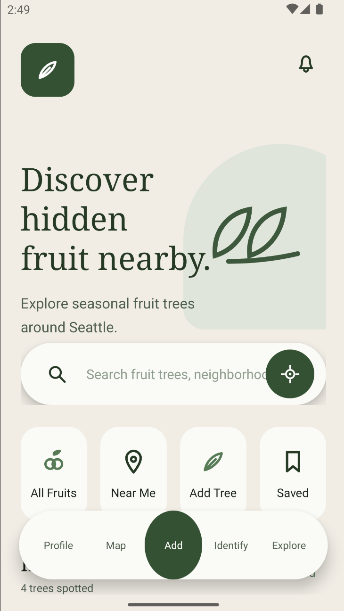
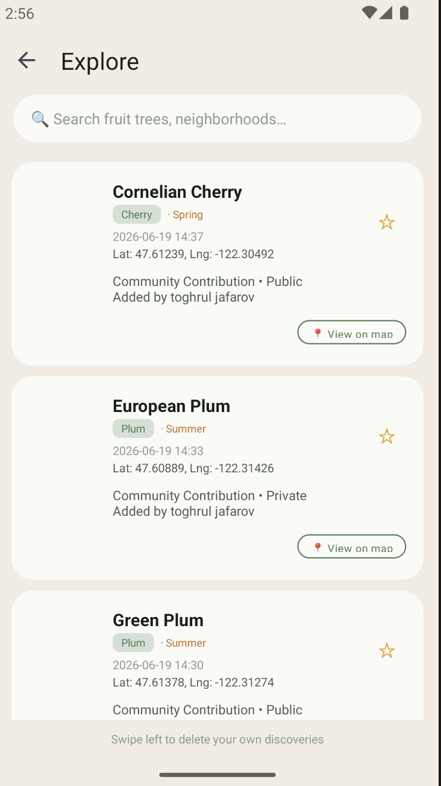
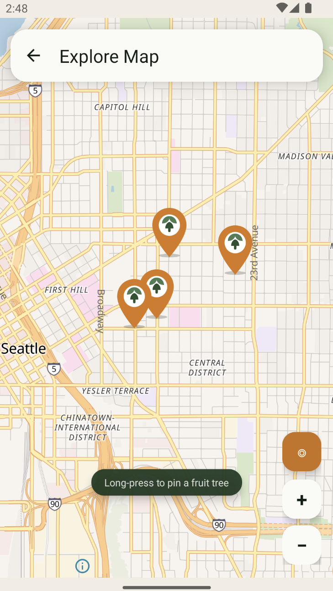
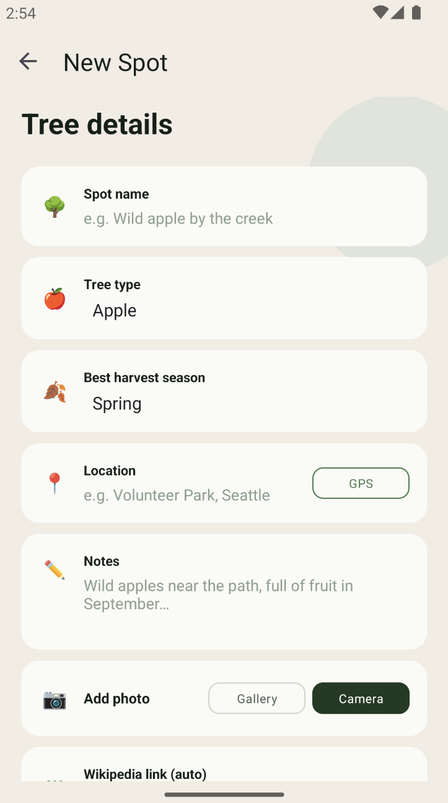
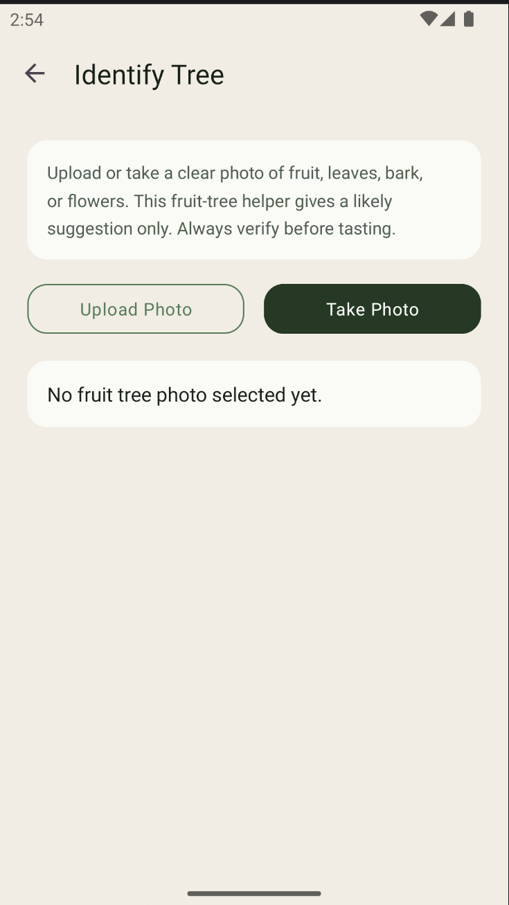
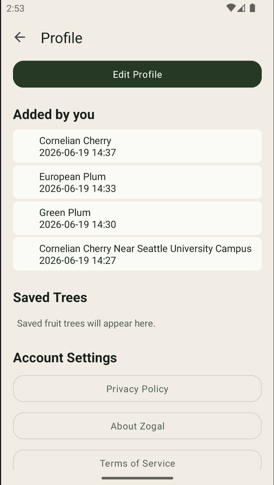

# Zogal

Discover hidden fruit nearby.

Zogal is an Android application that helps people discover fruit trees and edible plants in Seattle through community contributions, interactive maps, and plant identification tools.

The project was inspired by a personal experience. After moving to Seattle, I unexpectedly found a cornelian cherry tree ("zoğal" in Azerbaijani) growing in a local neighborhood. That discovery inspired the idea for an app that helps people reconnect with nature and uncover seasonal fruit hidden throughout the city.

## Features

* Interactive fruit tree map powered by MapLibre
* Add and share fruit tree locations
* GPS-based location selection
* Save favorite discoveries
* Community-submitted fruit trees
* Seasonal fruit information
* Plant identification using PlantNet API
* User accounts and profiles
* Seattle open-data tree integration

## Screenshots

  
  
  

  
  
  

## Tech Stack

* Kotlin
* Android SDK
* MapLibre
* Room Database
* ViewModel
* LiveData
* Kotlin Coroutines
* Glide
* PlantNet API
* Android Location Services

## Data Sources

* Seattle Open Data Tree Inventory
* Community-contributed fruit tree locations
* PlantNet plant identification service

## Future Improvements

* Multi-city support
* Community comments and ratings
* Harvest notifications
* Offline map support
* Improved plant identification
* Social features and discovery feed

## Author

Toghrul Jafarov
GitHub: https://github.com/Toghrul89
LinkedIn: https://www.linkedin.com/in/toghruljafarov/
